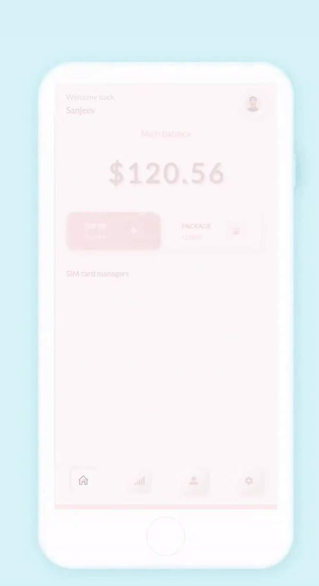
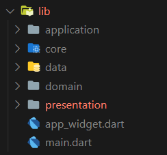

[](https://github.com/Shadow60539/data_app)    

# Introduction

> “data_app”
is a small, simple and beautiful app that displays data management in minimalistic desgin.

Before we start, you can take a look at the app:



## Features

- [x] UI is conmpleted.
- [ ] Integrate device specific data.


## How To Use

To clone and run this application, you'll need [Git](https://git-scm.com) and [Flutter](https://flutter.dev/docs/get-started/install) installed on your computer. From your command line:

```bash
# Clone this repository
$ git clone https://github.com/Shadow60539/data_app.git

# Go into the repository
$ cd data_app.git

# Install dependencies
$ flutter packages get

# Run the app
$ flutter run
```


### Packages


Some very good packages are used in the project, not a big list.


Below are the information about these packages.


package | explain
---|---
[flutter_neumorphic](https://pub.flutter-io.cn/packages/flutter_neumorphic) | Neumorphic Soft Widget
[font_awesome_flutter](https://pub.flutter-io.cn/packages/font_awesome_flutter) | Awesome icons
[flutter_svg](https://pub.flutter-io.cn/packages/flutter_svg) | Support svg files
[lottie](https://pub.flutter-io.cn/packages/lottie) | Lottie files animations
[google_fonts](https://pub.flutter-io.cn/packages/google_fonts) | Google fonts 
[lint](https://pub.flutter-io.cn/packages/lint) | Rules handler for Dart

### Directory Structure

The project directory structure is as follows:

```
├── android
├── asset
├── build
├── images
├── ios
├── lib
├── pubspec.lock
├── pubspec.yaml

```


Let me explain the other directories besides **lib**:

directory | explain
---|---
images | readme images files
asset | images and lottie files

Then the lib directory





directory | explain
---|---
core | Global Classes
presentation | UI

